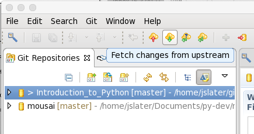

Introduction to Python for ME 4340/6340
---------------------------------------

Please follow these instructions step by step very carefully.

If on your own machine, please follow the `personal computer instructions <https://github.com/josephcslater/Introduction_to_Python/blob/master/README.rst>`_.

Working on the unix cluster machines
=====================================

Getting the notes local (since they are code, you want to be able to run them!)
~~~~~~~~~~~~~~~~~~~~~~~~~~~~~~~~~~~~~~~~~~~~~~~~~~~~~~~~~~~~~~~~~~~~~~~~~~~~~~~
This will get the notes onto your machine.

1. Log in per your log in sheet. Wait a bit.

2. Run the terminal. It should be readily apparent.

3. Type ``module load giteye``

4. Type ``GitEye``

5. In the window that opens, one of the icons has a help tip ``Clone a Git Repository and add the clone to this view``. Click on it.

|GitEyeClone|

6. Select ``GitHub`` and click ``Next >``

7. Search for a repository in ``Any Language`` (Choosing Python won't work!). Search for ``josephcslater/Introduction_to_Python``. EVERY LETTER MATTERS. ``_`` is an actual character. Click ``Next >``.

8. See ``master``. Ignore that (it's selected) and click ``Next >`` again.

9. Discover that you like this location. It looks like ``/home/``username``/git/Introduction_to_Python``. Click ``Finish >``. REMEMBER THIS PATH for later. (The ``Next >`` button seems useless here.)

10. Close this window and go back to terminal.

Let's take a breather here. If I make changes to this repository, you can now get them by running ``GitEye`` and simply click on the ``Fetch changes from upstream`` button.

|Fetch_changes|

Running the notes
~~~~~~~~~~~~~~~~~

1. Go back to the terminal

2. Use the ``cd`` command to change the directory to where the notes are. ``/home/``username``/git/Introduction_to_Python``. ``username`` will likely be the last part of your prompt. If you don't know who you are, type ``whoami``

3. Type ``module load anaconda/5001``

4. Type ``jupyter-notebook``

5. Double-click on the ``Introduction_to_Scientific_Python.ipynb`` file.

6. ``shift-enter`` runs cells. 

.. |GitEyeClone| image:: GitEyeClone.png

