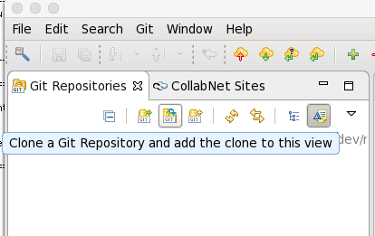

Introduction to Python for ME 4340/6340
---------------------------------------

Please follow these instructions step by step very carefully.

If on your own machine, please follow the `personal computer instructions <https://github.com/josephcslater/Introduction_to_Python/blob/master/README.rst>`_.

Working on the unix cluster machines
=====================================

1. Log in per your log in sheet. Wait a bit.

2. Run the terminal. It should be readily apparent.

3. Type `module load giteye`

4. Type `GitEye`

5. In the window that opens, one of the icons has a help tip `Clone a Git Repository and add the clone to this view`

6.
